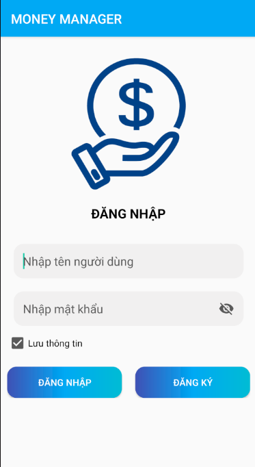
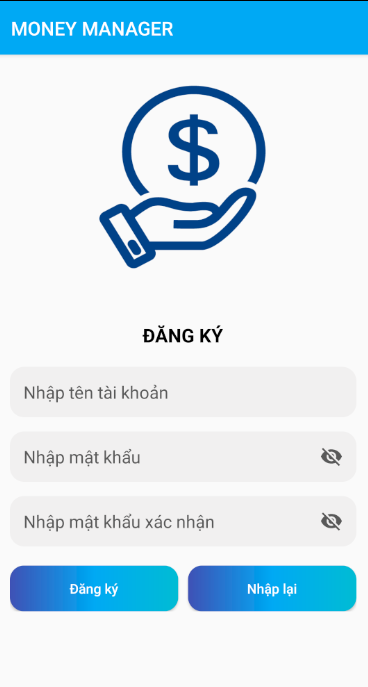

"# MoneyManager" 
# Ứng dụng Money Manager - Quản lí chi tiêu

Ứng dụng  sổ tay chi tiêu để liệt kê các nguồn thu nhập và khoản chi. Cuối tháng sau khi tổng kết bạn sẽ biết được rằng mình đã tiêu tiền vào những việc gì, việc nào cần thiết việc nào không rồi từ đó đưa ra những điều chỉnh hợp lý cho tháng sau

## Nội dung
1. [Chức năng](#chức-năng)

   1. [Đăng nhập / Đăng kí](#đăng-nhập--đăng-kí)

   2. [Đổi mật khẩu](#đổi-mật-khẩu)

   3. [Thống kê chi tiêu](#thống-kê)
   
   4. [Thêm,Xóa loại thu, chi](#thêmxóa-loại-thu-chi)

   5. [Thêm,Xóa khoản thu, chi](#thêmxóa-khoản-thu-chi)

   6. [Chuyển đổi dạng xem](#chuyển-đổi-dạng-xem)
   
   7. [Xem thông tin tài khoản](#xem-thông-tin-tài-khoản)
   
   
2. [Yêu cầu thiết bị](#yêu-cầu-thiết-bị)

3. [Thư viện và công nghệ](#thư-viện-và-công-nghệ)

4. [Tác giả](#tác-giả)

5. [Giấy phép](#giấy-phép)

## Chức năng
### Đăng nhập / Đăng kí
   * Đăng nhập
  
   * Đăng kí
   
   

    
   

    
### Đổi mật khẩu
  * Đổi mật khẩu
   
   

   
   

    
### Thống kê chi tiêu
   * Thống kê chi tiêu
  

     
   

    
   

### Thêm,Xóa loại thu, chi
   * Thêm loại chu
  
   * Xóa loại thu
   
   

    
   

### Thêm,Xóa khoản thu, chi
   
   * Thêm khoản chu
  
   * Xóa khoản thu
   

   
   

### Chuyển đổi dạng xem
   * Chuyển dạng xem loại danh sách
  
   * Chuyển loại xem dạng lưới
   
   

     
   

### Xem thông tin tài khoản
   * Xem thông tin tài khoản
  
   
   

    
   

   
## Yêu cầu thiết bị
-Android:

   +Android studio : 3.0.1

   +Gradle : 5.6.4

   +Min sdk : 16

   +Target sdk : 29

## Thư viện và công nghệ

- Language : Java

- Database: SQLite

* Admob Banner ads - :https://developers.google.com/admob/android/banner

* Firebase cloud messaging - https://firebase.google.com/products/cloud-messaging

* UI floating-Action_Button: https://github.com/Clans/FloatingActionButton

* UI CircleImageView: https://github.com/hdodenhof/CircleImageView

## Tác giả
Phạm Hoài Bảo - 19520406@gm.uit.edu.vn

## Giấy phép

    Copyright 2020 - Pham Hoai Bao

    Licensed under the Apache License, Version 2.0 (the "License");
    you may not use this file except in compliance with the License.
    You may obtain a copy of the License at

       http://www.apache.org/licenses/LICENSE-2.0

    Unless required by applicable law or agreed to in writing, software
    distributed under the License is distributed on an "AS IS" BASIS,
    WITHOUT WARRANTIES OR CONDITIONS OF ANY KIND, either express or implied.
    See the License for the specific language governing permissions and
    limitations under the License.
